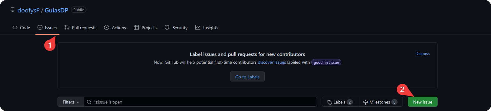

# Introducción

    </img>

## ¿Qué es esto?

Un conjunto de guías reunidas dentro de una documentación. Este proyecto nace dentro del entorno del servidor [Discord](https://discord.gg/doofy-s-projects-704042607600205956) y la necesidad de mejorar el sistema de ayuda, el cual se manejaba hasta entonces, por ello y por el mejoramiento del mismo, se hizo una gran parte de cambios, tanto internos en sus pautas, en los sistemas dentro del servidor y fuera de este llegando a la creación de esta documentación que aloja todo lo relacionado con guías informativas y para la solución de problemas.

### ¿Qué encontraré aquí?

De manera organizada, todas las guías útiles que podamos recopilar en esta documentación separada por categorías como lo son:
- ### [Instalación](https://docs.dprojects.org/docs/category/instalaci%C3%B3n)
Toda información útil para la práctica o conocimiento con respecto la instalación de sistemas u otros.

- ### [Información](https://docs.dprojects.org/docs/category/informaci%C3%B3n)
Conocimiento variado frente a temas informáticos de relevancia e interés.

- ### [Optimización](https://docs.dprojects.org/docs/category/optimizaci%C3%B3n)
Saberes y técnicas transcritas para mejorar el entorno de tu ordenador a favor del mejoramiento del mismo.

- ### [Errores](https://docs.dprojects.org/docs/category/errores)
La ayuda para dar solución a errores conocidos o poco conocidos que se hayan encontrado y resuelto.

:::note Nota
Estas categorías y su contenido puede verse sujeto a cambios.
:::

## ¿Cómo contribuir a este proyecto?

En el repositorio de [GitHub](https://github.com/doofysp/GuiasDP/) es posible contribuir al mejoramiento del proyecto, tanto con guías como en cuestion de desarrollo, de la misma manera, facilitamos que en el servidor de **Discord** que puedas comunicarte con los administradores y puedas hablar con ellos para contribuir.

